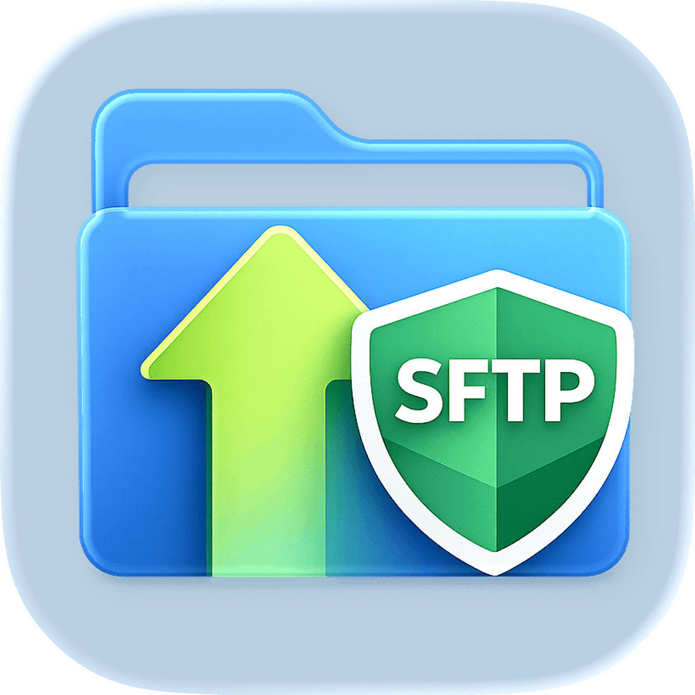

# SFTP Browser

<p align="center">
  
</p>

`SFTP Browser` is a small macOS app for connecting to an SFTP server, browsing remote files, and moving files or folders between your Mac and the server.

It is built for simple username and password SFTP workflows. The app does not require `/usr/bin/sftp`, `sshpass`, Homebrew, or any other command-line SFTP tool to be installed on the system.

## What The App Does

The app lets you:

- connect to an SFTP server with host, port, username, password, and starting folder
- save connection profiles for servers you use often
- remember the last connection details on launch
- browse remote folders in a table view
- jump to a path by typing it into the folder field
- go up a folder, refresh, or create a new folder from the toolbar
- use keyboard shortcuts for common actions
- select one or more files or folders
- sort by column headers
- preview remote files with Quick Look
- upload files and folders
- download files and folders
- drag files or folders into the app to upload
- drag files or folders out to Finder to download
- rename or delete remote items from the right-click menu
- delete selected remote items from the toolbar
- clean up remote `.DS_Store` files from the macOS Tools menu
- see transfer progress, ETA, queued transfers, and completed transfers
- cancel active or queued transfers

## Connections

SFTP Browser supports username and password authentication.

Connection details are shown at the top of the window:

- `Host`
- `Port`
- `Username`
- `Password`
- `Remote Path`

The password field includes a small visibility toggle so you can briefly check what you typed before connecting.

Saved profiles are available from the connection menu. Profiles store the server details and remote path. Passwords are stored separately in Keychain.

## File Browsing

The remote file list supports common browser actions:

- double-click a folder to open it
- select files or folders before downloading
- use multi-select for batch downloads
- right-click files or folders for rename and delete
- right-click empty space to create a folder
- click column headers to sort
- press Space to download the selected file to a temporary location and open it in Quick Look

The table shows basic remote metadata:

- name
- size
- modified date
- permissions

Symlinks are shown as links. They can be deleted without deleting the linked target, but downloads and Quick Look previews do not follow symlinks.

## Tools

The macOS Tools menu includes:

- `Clean Up .DS_Store`

This tool starts at the current remote folder and recursively removes `.DS_Store` files left behind by macOS. It only targets `.DS_Store` files and leaves other remote files alone.

## Keyboard Shortcuts

SFTP Browser supports common macOS shortcuts:

- `Command-R` refreshes the current remote folder
- `Command-N` creates a new remote folder
- `Command-U` uploads files or folders
- `Command-Shift-D` downloads the selected items
- `Delete` deletes selected remote items when the remote file table is focused

Shortcuts apply to the active window only.

## Transfers

Uploads and downloads run through a transfer queue.

For larger transfers, the app shows:

- current progress
- transferred bytes
- estimated time remaining
- cancel controls

Small transfers may complete without showing a blocking overlay. Longer transfers show progress so it is clear that work is still happening.

Folder uploads, folder downloads, and folder deletion are recursive.

Before recursive uploads or downloads start, the app checks for destination conflicts throughout the folder tree. If nested files or folders would be overwritten, the app shows one warning before anything is transferred.

## Security

SFTP Browser verifies host keys.

The first time you connect to a server, the app asks whether to trust the presented host key. After that, future connections compare the server key against the trusted value. If the key changes, the app blocks the connection until the trusted host entry is reviewed.

Passwords are stored in macOS Keychain. Connection profiles and trusted host records are stored locally in app preferences.

Quick Look previews are written to a temporary local folder before being opened by macOS Quick Look.

## Dependencies / Attribution

SFTP Browser uses Swift Package Manager dependencies that are built into the app. These dependencies are used so the app can speak SFTP directly instead of launching an external command-line tool.

### Citadel

Repository: `https://github.com/orlandos-nl/Citadel.git`

Citadel provides the SSH and SFTP client functionality used by the app.

### SwiftNIO

Repository: `https://github.com/apple/swift-nio.git`

SwiftNIO provides the networking foundation used by Citadel and by the app's transfer code.

### Supporting Packages

The dependency tree also includes:

- `swift-nio-ssh`
- `swift-crypto`
- `swift-log`
- `BigInt`
- `swift-atomics`
- `swift-collections`
- `swift-asn1`
- `swift-system`

Resolved dependency versions are pinned in:

`SFTP-Browser.xcodeproj/project.xcworkspace/xcshareddata/swiftpm/Package.resolved`

The app also uses standard macOS system frameworks for the UI, Keychain access, and Quick Look previews. These are provided by macOS and are not bundled third-party dependencies.

## Build

Open `SFTP-Browser.xcodeproj` in Xcode and build the `SFTP-Browser` scheme.

From the command line:

```bash
xcodebuild \
  -project SFTP-Browser.xcodeproj \
  -scheme SFTP-Browser \
  -destination generic/platform=macOS \
  build
```

## Test Fixtures

The repository includes a helper script for validating nested overwrite warnings:

```bash
scripts/prepare-transfer-conflict-fixtures.sh user@server
```

Run it without a server argument to create the local fixtures and print the remote setup commands:

```bash
scripts/prepare-transfer-conflict-fixtures.sh
```

## Caveats

- SFTP Browser is meant to be a simple file browser, not a full replacement for every advanced SFTP client.
- Username and password authentication is supported. SSH key authentication is not currently exposed in the UI.
- Symlink downloads and previews are not followed automatically. Select the linked target instead.
- Update checking requires an `UpdateCheckReleasesURL` value in the app's generated Info.plist settings.

## Changelog

### 1.0.2
- Added a timestamp to each item in the activity monitor.

### 1.0.1
- Added cmd+up/down keyboard nav. 
- Added refresh and download to right click context menus.

### 1.0.0

- Initial release.
